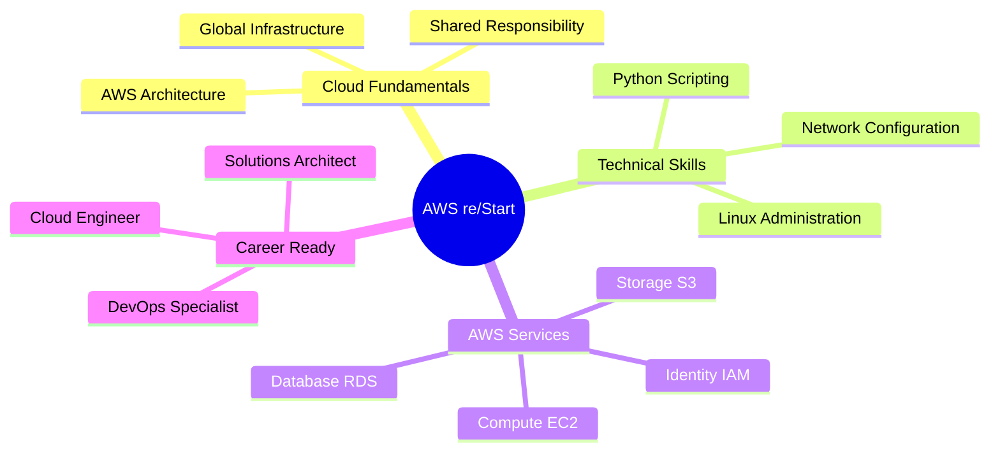

<div align="center">

# ⚡ AWS re/Start Journey

[](https://git.io/typing-svg)


</div>

---

## 🎯 About This Repository

Welcome to my **AWS re/Start Learning Repository** — a living collection of notes, labs, and reflections documenting my journey through the **AWS re/Start program**.

> **"I break and learn things online"** — This repo is proof of that journey, from **Linux fundamentals** to **AWS Cloud architecture**, **Python automation**, and **DevOps best practices**.

```python
# My Daily Learning Loop
while learning:
    read_documentation()
    build_labs()
    break_things()
    debug_and_learn()
    document_progress()
    repeat()
```

---

## 🚀 Learning Roadmap

<table>
<tr>
<td width="50%">

### 📖 Core Topics
- ✅ Professional Skills
- ✅ Cloud Foundations
- 🔄 Linux Essentials
- 🔄 Networking Fundamentals
- 📝 Security Best Practices
- 📝 AWS Core Services

</td>
<td width="50%">

### 🛠️ Technical Stack
- ⚡ EC2, S3, RDS, IAM
- 🗄️ Databases & Storage
- 🤖 Automation & DevOps
- 🚢 Containers & Scaling
- ☁️ Serverless Computing
- 🐍 Python Scripting

</td>
</tr>
</table>

---

## 🎓 Current Progress

<div align="center">

| Phase | Status | Completion |
|-------|--------|------------|
| 🤝 Professional Skills |  | 100% |
| ☁️ Cloud Foundations |  | 100% |
| 🐧 Linux Essentials |  | 75% |
| 🌐 Networking |  | 60% |
| 🔒 Security |  | 40% |
| 🚀 AWS Services |  | 30% |

</div>

---

## 🎯 Learning Goals

<div align="center">



</div>

**Mission Critical:**
- 🎯 **Strengthen** cloud fundamentals through hands-on practice
- 🔬 **Master** core AWS services with real-world labs
- 🏗️ **Build** deployable cloud projects and architectures
- 📝 **Document** every step of the learning journey
- 🚀 **Achieve** AWS Solutions Architect certification readiness

---

## 📂 Repository Structure

```bash
aws-restart-journey/
│
├── 📄 README.md                    # You are here!
│
├── 🤝 00-professional-skills/
│   ├── notes.md                   # Soft skills & career prep
│   ├── exercises/                 # Communication & teamwork
│   └── reflections.md             # Personal growth insights
│
├── ☁️ 01-cloud-foundations/
│   ├── notes.md                   # Cloud computing basics
│   ├── labs/                      # Hands-on exercises
│   └── quizzes/                   # Knowledge checks
│
├── 🐧 02-linux/
│   ├── commands.md                # Essential Linux commands
│   ├── labs/                      # System administration
│   └── practice.md                # Shell scripting exercises
│
├── 🌐 03-networking/
│   ├── theory.md                  # Network fundamentals
│   ├── diagrams/                  # Visual network topologies
│   └── labs/                      # Practical configurations
│
├── 🔒 04-security/
│   ├── notes.md                   # Security principles
│   ├── labs/                      # IAM, encryption, compliance
│   └── key-concepts.md            # Best practices
│
├── 🚀 05-aws-services/
│   ├── compute/                   # EC2, Lambda, ECS
│   ├── storage/                   # S3, EBS, EFS
│   ├── database/                  # RDS, DynamoDB
│   └── management-tools/          # CloudWatch, CloudFormation
│
├── 🏗️ 06-projects/
│   ├── lab1-setup-ec2/           # Deploy virtual servers
│   ├── lab2-s3-website/          # Host static websites
│   └── final-project/            # Capstone architecture
│
└── 📊 progress.md                 # Weekly learning updates
```

---

## 🔥 Featured Labs & Projects

<div align="center">

| Project | Description | Tech Stack | Status |
|---------|-------------|------------|--------|
| 🖥️ **EC2 Web Server** | Deploy scalable web server | EC2, Security Groups | ✅ Complete |
| 🌐 **Static Website** | S3-hosted portfolio site | S3, CloudFront | 🔄 In Progress |
| 🗄️ **Database Setup** | RDS with backup strategy | RDS, MySQL, IAM | 📝 Planned |
| 🤖 **Lambda Function** | Serverless image processor | Lambda, S3, Python | 📝 Planned |
| 🏗️ **Multi-Tier App** | Full-stack cloud deployment | EC2, RDS, ALB, VPC | 📝 Planned |

</div>

---

## 💡 Key Learnings & Insights

<details>
<summary><b>🐧 Linux Administration</b></summary>

- Mastered file system navigation and permissions
- Automated tasks with bash scripting
- Configured system services and networking
- Implemented security hardening techniques

</details>

<details>
<summary><b>🌐 Networking Fundamentals</b></summary>

- Understood OSI model and TCP/IP protocols
- Configured VPCs, subnets, and routing tables
- Implemented security groups and NACLs
- Designed hybrid cloud network architectures

</details>

<details>
<summary><b>☁️ AWS Cloud Services</b></summary>

- Deployed and managed EC2 instances
- Configured S3 buckets with lifecycle policies
- Set up RDS with automated backups
- Implemented IAM roles and policies

</details>

---

## 📈 Learning Metrics

<div align="center">


</div>

---

## 🛠️ Tools & Technologies

<div align="center">


</div>

---

## 📚 Resources & References

- 📖 [AWS Documentation](https://docs.aws.amazon.com/)
- 🎥 [AWS Training Portal](https://www.aws.training/)
- 🏆 [AWS Certification Paths](https://aws.amazon.com/certification/)
- 💻 [AWS Free Tier](https://aws.amazon.com/free/)
- 🌍 [AWS Community](https://community.aws/)

---

## 🤝 Connect & Collaborate

<div align="center">

[](https://github.com/MuigaiEdwin)
[](https://www.linkedin.com/in/muigaiedwin/)
[](https://x.com/MuigaiEd)


</div>

---

<div align="center">

### ⭐ If you find this helpful, consider giving it a star!

**"The cloud is not a place, it's a way of thinking."**


</div>