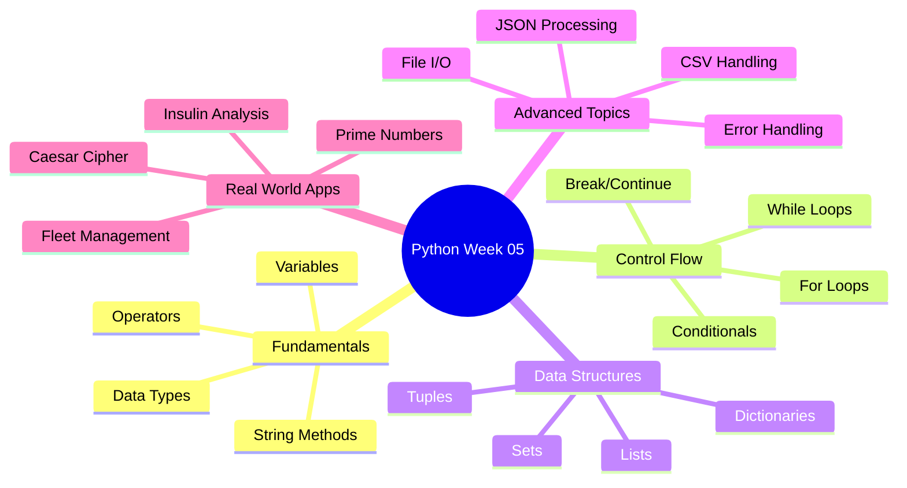

<div align="center">

# 🐍 Week 05: Python Programming Fundamentals

[](https://git.io/typing-svg)


</div>

---

## 🎯 About This Project

Welcome to my **Week 05 Python Programming Repository** — a comprehensive collection of scripts, exercises, and real-world applications demonstrating mastery of Python fundamentals.

> **"Break it, debug it, learn from it"** — This week transformed theoretical knowledge into practical coding skills through **35+ Python scripts** covering everything from **basic syntax** to **bioinformatics algorithms**.

```python
# My Learning Loop This Week
while not mastered:
    learn_concept()
    write_code()
    encounter_bugs()
    debug_systematically()
    document_solution()
    level_up()
```

---

## 🚀 Learning Roadmap

<table>
<tr>
<td width="50%">

### 📖 Core Concepts
- ✅ Data Types & Variables
- ✅ String Manipulation
- ✅ Numeric Operations
- ✅ Control Flow (if/else)
- ✅ Loops (for/while)
- ✅ Collections (lists, dicts, sets)

</td>
<td width="50%">

### 🛠️ Advanced Skills
- ✅ File I/O Operations
- ✅ JSON Processing
- ✅ CSV Data Handling
- ✅ Algorithm Implementation
- ✅ Debugging Techniques
- ✅ Modular Programming

</td>
</tr>
</table>

---

## 🎓 Progress Overview

<div align="center">

| Topic | Status | Completion |
|-------|--------|------------|
| 🔤 String Operations |  | 100% |
| 🔢 Numeric Data |  | 100% |
| 🔁 Loops & Control Flow |  | 100% |
| 📚 Collections |  | 100% |
| 📂 File Handling |  | 95% |
| 🐛 Debugging |  | 90% |
| 🧬 Bioinformatics |  | 85% |

</div>

---

## 🎯 Key Learning Objectives

<div align="center">



</div>

**Mission Critical:**
- 🎯 **Master** Python syntax and core programming concepts
- 🔬 **Implement** algorithms from scratch (encryption, analysis)
- 🏗️ **Build** practical applications solving real problems
- 📝 **Debug** systematically using proven techniques
- 🚀 **Apply** Python to bioinformatics and data processing

---

## 📂 Repository Structure

```bash
Week_05_Python_Programming/
│
├── 📄 README.md                          # You are here!
│
├── 🎓 Fundamentals/
│   ├── Hello-world.py                   # First Python program
│   ├── string-datatype.py               # String manipulation mastery
│   ├── numeric-data.py                  # Numbers and calculations
│   ├── conditionals.py                  # Decision-making logic
│   ├── for-loop.py                      # Iteration patterns
│   ├── while-loopy.py                   # Loop control structures
│   └── test.py                          # Experimental playground
│
├── 📚 Data Structures/
│   ├── collection.py                    # Working with collections
│   ├── my_collections.py                # Custom implementations
│   ├── composite-data.py                # Complex data structures
│   └── categorize-values.py             # Data classification
│
├── 🔐 Cryptography Module/
│   ├── caesar.py                        # ✨ Caesar cipher (complete)
│   ├── debug-caesar-1.py                # 🐛 Debugging level 1
│   ├── debug-caesar-2.py                # 🐛 Debugging level 2
│   ├── debug-caesar-3.py                # 🐛 Debugging level 3
│   └── debug-caesar-4.py                # 🐛 Debugging level 4
│
├── 🧬 Bioinformatics Application/
│   ├── analyze-insulin.py               # ⭐ Main analysis tool
│   ├── stringinsulin.py                 # String operations
│   ├── net-charge.py                    # Protein charge calculator
│   ├── preproinsulin-seq.txt            # Raw sequence data
│   ├── preproinsulin-seq-clean.txt      # Cleaned output
│   ├── lsinsulin-seq-clean.txt          # LS chain
│   ├── binsulin-seq-clean.txt           # B chain
│   ├── cinsulin-seq-clean.txt           # C chain
│   └── ainsulin-seq-clean.txt           # A chain
│
├── 📊 Data Processing/
│   ├── jsonFileHandler.py               # 📦 Reusable JSON module
│   ├── calc_weight_json.py              # Weight calculations
│   ├── car_fleet.csv                    # Sample dataset
│   └── files/
│       └── insulin.json                 # Structured data
│
├── 🛠️ Algorithms & Utilities/
│   ├── prime.py                         # Prime number checker
│   ├── primenumber.py                   # Prime generator
│   ├── sys-admin.py                     # System tasks
│   ├── debugger.py                      # Debugging toolkit
│   └── results.txt                      # Output logs
│
├── 🌐 Web Interface/
│   └── devopslab.html                   # Bonus web component
│
└── 🗂️ Cache/
    └── __pycache__/                     # Python bytecode
        └── jsonFileHandler.cpython-311.pyc
```

---

## 🔥 Featured Projects & Labs

<div align="center">

| Project | Description | Key Concepts | Status |
|---------|-------------|--------------|--------|
| 🔐 **Caesar Cipher** | Classic encryption algorithm | Strings, ASCII, Loops | ✅ Complete |
| 🧬 **Insulin Analyzer** | Protein sequence processor | File I/O, Parsing, Biology | ✅ Complete |
| 📊 **JSON Calculator** | Weight computation tool | JSON, Data structures | ✅ Complete |
| 🐛 **Debug Series** | 4-level debugging challenge | Problem-solving, Logic | ✅ Complete |
| 🔢 **Prime Generator** | Mathematical algorithm | Loops, Conditionals, Math | ✅ Complete |
| 🚗 **Fleet Manager** | CSV data analyzer | CSV, Collections, Analysis | 🔄 In Progress |

</div>

---

## 💡 Deep Dive: Key Scripts

<details>
<summary><b>🔐 caesar.py — Encryption Algorithm</b></summary>

**What it does:**
- Implements the Caesar cipher encryption technique
- Shifts each letter by a specified number of positions
- Preserves special characters and spacing

**Key Learning:**
- Character manipulation with `ord()` and `chr()`
- Modular arithmetic for wraparound
- Preserving data integrity during transformation

**Run it:**
```bash
python caesar.py
# Input: "HELLO WORLD" with shift 3
# Output: "KHOOR ZRUOG"
```

</details>

<details>
<summary><b>🧬 analyze-insulin.py — Bioinformatics Application</b></summary>

**What it does:**
- Processes preproinsulin amino acid sequences
- Extracts individual peptide chains (LS, B, A, C)
- Cleans and exports processed sequences
- Performs molecular property calculations

**Key Learning:**
- String slicing and indexing techniques
- File reading and writing operations
- Real-world application of Python in biology
- Data validation and cleaning

**Scientific Context:**
Insulin is initially synthesized as preproinsulin, which must be cleaved into functional chains. This tool simulates that biological process.

**Run it:**
```bash
python analyze-insulin.py
# Outputs: 4 clean sequence files + analysis report
```

</details>

<details>
<summary><b>📊 calc_weight_json.py — Data Processing</b></summary>

**What it does:**
- Reads structured JSON data from files
- Performs weight calculations and conversions
- Demonstrates JSON parsing and manipulation

**Key Learning:**
- Working with the `json` module
- Dictionary traversal and data extraction
- Modular code with imports

**Run it:**
```bash
python calc_weight_json.py
# Processes: files/insulin.json
```

</details>

<details>
<summary><b>🐛 debug-caesar-*.py — Debugging Series</b></summary>

**What it does:**
A progressive 4-level debugging challenge where you fix increasingly complex bugs in Caesar cipher implementations.

**Key Learning:**
- Systematic bug identification
- Reading error messages effectively
- Testing edge cases
- Logic flow analysis

**Progression:**
1. **Level 1:** Syntax errors
2. **Level 2:** Logic errors
3. **Level 3:** Off-by-one errors
4. **Level 4:** Complex algorithm bugs

</details>

<details>
<summary><b>📦 jsonFileHandler.py — Reusable Module</b></summary>

**What it does:**
A custom module for consistent JSON file operations across projects.

**Features:**
- `readJsonFile()` — Load JSON data
- `writeJsonFile()` — Save JSON data
- Error handling built-in

**Usage:**
```python
import jsonFileHandler

data = jsonFileHandler.readJsonFile('files/insulin.json')
print(data)
```

</details>

---

## 📈 Learning Metrics

<div align="center">


</div>

---

## 🛠️ Technologies & Tools

<div align="center">


**Core Libraries Used:**
- `json` — JSON data processing
- `csv` — CSV file handling
- `sys` — System-specific parameters
- `os` — Operating system interface

</div>

---

## 💻 Quick Start Guide

### Prerequisites
```bash
# Check Python version
python --version  # Should be 3.11+

# Verify installation
python -c "import sys; print(sys.version)"
```

### Running the Scripts

**1. Basic Syntax Examples:**
```bash
python Hello-world.py
python string-datatype.py
python numeric-data.py
```

**2. Encryption Tool:**
```bash
python caesar.py
# Follow interactive prompts
```

**3. Bioinformatics Analysis:**
```bash
python analyze-insulin.py
# Outputs cleaned sequence files
```

**4. Data Processing:**
```bash
python calc_weight_json.py
python jsonFileHandler.py
```

**5. Algorithm Challenges:**
```bash
python prime.py
python primenumber.py
```

---

## 🎓 What I Learned

<table>
<tr>
<td width="50%" valign="top">

### 🧠 Technical Skills
- ✅ Python syntax and semantics
- ✅ Object-oriented thinking
- ✅ Algorithm implementation
- ✅ File I/O operations
- ✅ JSON/CSV data handling
- ✅ Error handling patterns
- ✅ Code debugging strategies

</td>
<td width="50%" valign="top">

### 🚀 Soft Skills
- ✅ Problem decomposition
- ✅ Systematic debugging
- ✅ Code documentation
- ✅ Attention to detail
- ✅ Persistence through challenges
- ✅ Self-directed learning
- ✅ Code organization

</td>
</tr>
</table>

---

## 🌟 Project Highlights

> **Real-World Applications**: From cryptography to bioinformatics, these scripts demonstrate Python's versatility

> **Progressive Complexity**: Started with "Hello World", ended with multi-file data processing systems

> **Debugging Mastery**: Completed 4-level debugging challenge, developing systematic troubleshooting skills

> **Modular Design**: Built reusable components like `jsonFileHandler.py` for future projects

> **Clean Code**: Focused on readability, documentation, and best practices

---

## 📚 Concepts Mastered

<div align="center">

| Category | Topics Covered |
|----------|---------------|
| **Basics** | Variables, Data Types, Operators, Comments |
| **Strings** | Indexing, Slicing, Methods, Formatting, Concatenation |
| **Numbers** | Integers, Floats, Math Operations, Type Conversion |
| **Control Flow** | if/elif/else, Comparison Operators, Logical Operators |
| **Loops** | for loops, while loops, range(), break, continue |
| **Collections** | Lists, Dictionaries, Tuples, Sets, Comprehensions |
| **Files** | open(), read(), write(), with statement, File paths |
| **JSON** | json.load(), json.dump(), Serialization |
| **CSV** | csv.reader(), csv.writer(), Data processing |
| **Functions** | def, return, Parameters, Arguments, Scope |
| **Debugging** | Print debugging, Error messages, Logic tracing |
| **Algorithms** | Caesar cipher, Prime detection, Sequence parsing |

</div>

---

## 🎯 Next Steps & Goals

**Short Term:**
- [ ] Add comprehensive docstrings to all functions
- [ ] Implement unit tests with `pytest`
- [ ] Refactor code for better modularity
- [ ] Add command-line arguments with `argparse`

**Medium Term:**
- [ ] Build a web interface for Caesar cipher
- [ ] Extend insulin analysis with visualization
- [ ] Create a CLI tool for CSV processing
- [ ] Package scripts as installable module

**Long Term:**
- [ ] Contribute to bioinformatics open-source projects
- [ ] Build portfolio website showcasing these projects
- [ ] Write technical blog posts about learnings
- [ ] Mentor others learning Python

---

## 📖 Resources Used

- 📘 [Python Official Documentation](https://docs.python.org/3/)
- 🎥 [Python for Everybody](https://www.py4e.com/)
- 💻 [Real Python Tutorials](https://realpython.com/)
- 🧬 [Biopython Documentation](https://biopython.org/)
- 🐛 [Python Debugging Guide](https://realpython.com/python-debugging-pdb/)

---

## 🤝 Connect & Collaborate

<div align="center">

[](https://github.com/MuigaiEdwin/)
[](https://linkedin.com/in/muigaiedwin/)
[](mailto:muigaiedd@gmail.com)

**Open to:**
- 💼 Collaboration on Python projects
- 🎓 Peer learning and code reviews
- 💡 Feedback and suggestions
- 🤝 Networking with fellow developers

</div>

---

## 📄 License

This project is licensed under the MIT License - see the [LICENSE](LICENSE) file for details.

---

<div align="center">

### ⭐ If you found this helpful, consider giving it a star!

**"Code is like humor. When you have to explain it, it's bad." — Cory House**


---

**Built with ❤️ and ☕ during Week 05 of my programming journey**

</div>