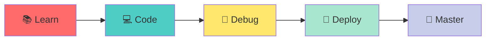
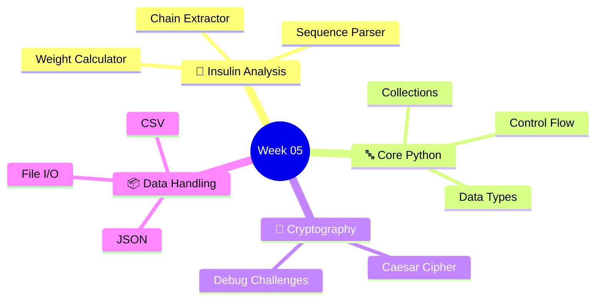
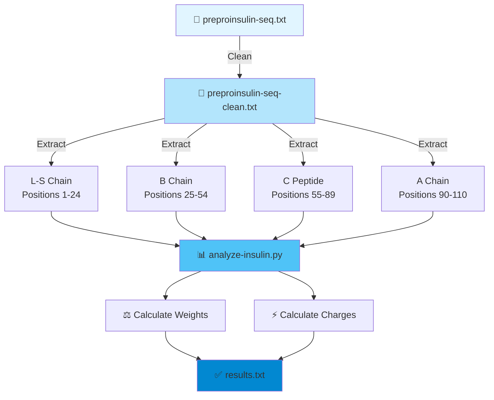
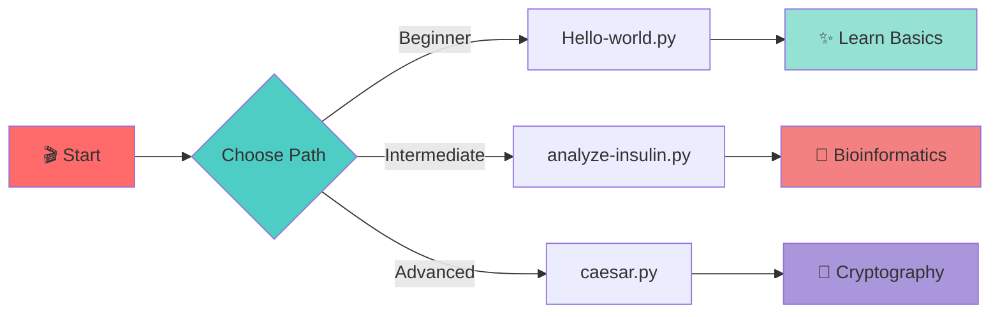
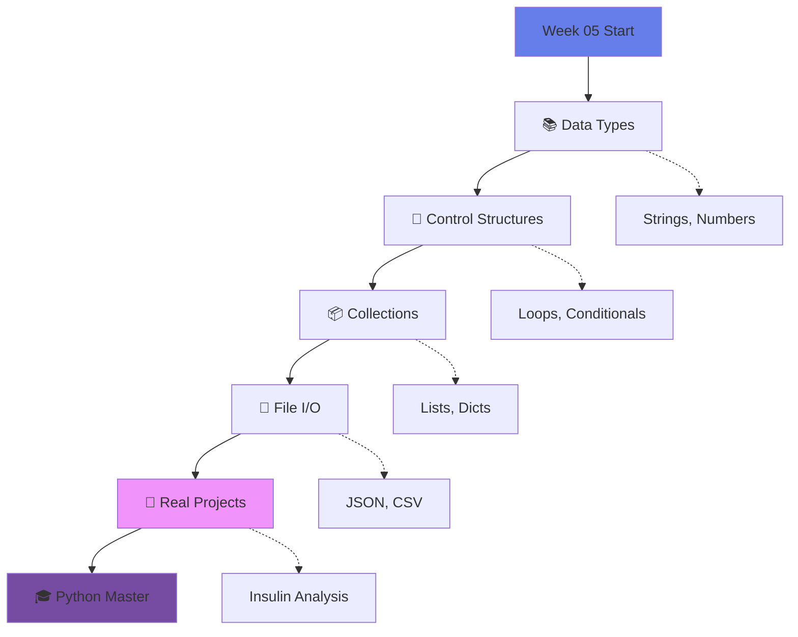
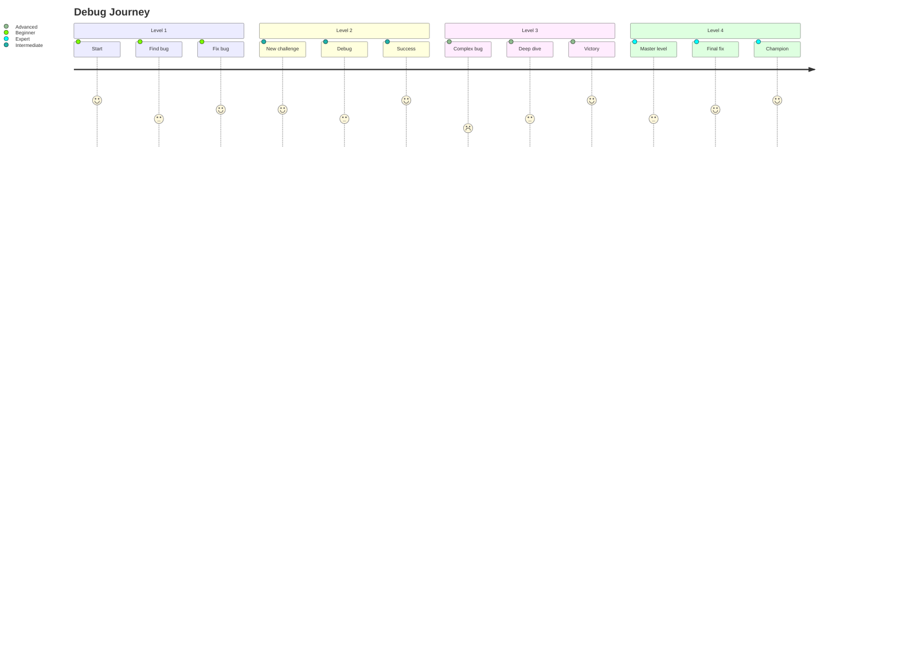
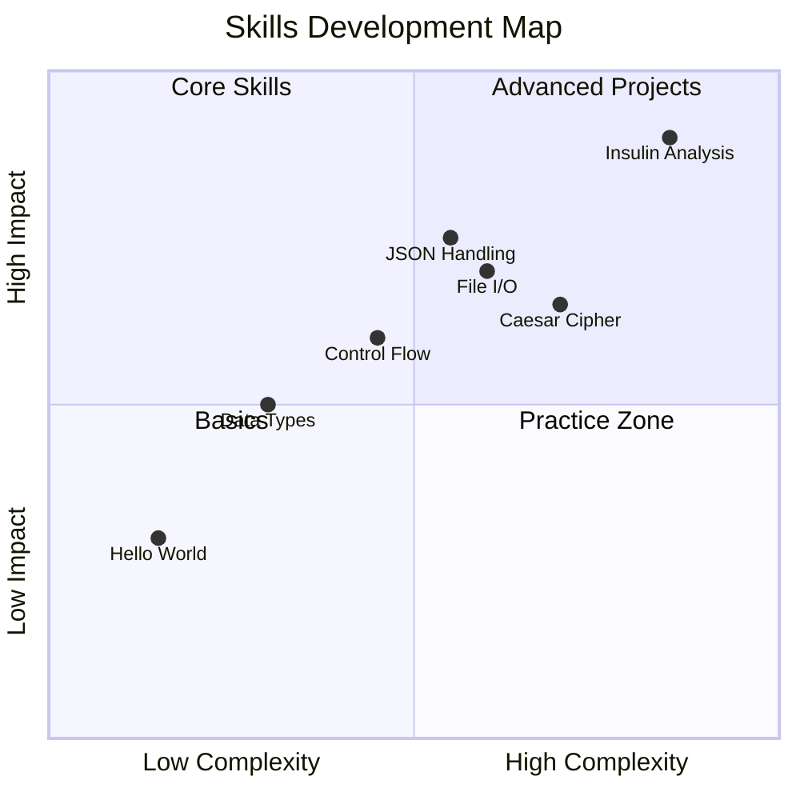

# 🐍 Week 05 - Python Programming Journey

> *From "Hello World" to Bioinformatics - A hands-on exploration of Python fundamentals*

<div align="center">



</div>

---

## 🎯 Repository Overview



---

## 🧬 Insulin Analysis Pipeline



---

## 🎮 Project Structure

<table>
<tr>
<td width="50%">

### 🔤 **Fundamentals**
```
📝 Hello-world.py
🔤 string-datatype.py
🔢 numeric-data.py
📦 collection.py
🎯 composite-data.py
```

</td>
<td width="50%">

### 🔄 **Control Flow**
```
➿ for-loop.py
🔁 while-loopy.py
❓ conditionals.py
✅ categorize-values.py
🔢 prime.py
```

</td>
</tr>
<tr>
<td>

### 🔐 **Cryptography**
```
🔒 caesar.py
🐛 debug-caesar-1.py
🐛 debug-caesar-2.py
🐛 debug-caesar-3.py
🐛 debug-caesar-4.py
```

</td>
<td>

### 📊 **Data Processing**
```
📋 jsonFileHandler.py
⚖️ calc_weight_json.py
🚗 car_fleet.csv
💾 sys-admin.py
```

</td>
</tr>
</table>

---

## 🚀 Quick Start Guide



**Run any script:**
```bash
python3 <filename>.py
```

---

## 💡 Learning Progression



---

## 🎯 Skills Matrix

<div align="center">

| Skill | Files | Level |
|-------|-------|-------|
| 🐍 **Python Basics** | Hello-world.py → numeric-data.py | ⭐⭐⭐⭐⭐ |
| 🔄 **Loops & Logic** | for-loop.py, while-loopy.py | ⭐⭐⭐⭐ |
| 📦 **Data Structures** | collection.py, my_collections.py | ⭐⭐⭐⭐ |
| 📂 **File Handling** | jsonFileHandler.py | ⭐⭐⭐⭐ |
| 🧬 **Bioinformatics** | analyze-insulin.py, net-charge.py | ⭐⭐⭐⭐⭐ |
| 🔐 **Cryptography** | caesar.py, debug-caesar-*.py | ⭐⭐⭐ |

</div>

---

## 🧪 Caesar Cipher Debug Challenge



---

## 🎨 What Makes This Special?

<div align="center">



</div>

---

## 📦 Files Overview

```
Week_05_Python_Programming/
│
├── 🧬 Insulin Project
│   ├── preproinsulin-seq.txt
│   ├── analyze-insulin.py
│   └── [chain files]
│
├── 🎓 Learning Modules
│   ├── Hello-world.py
│   ├── Data types & structures
│   └── Control flow scripts
│
├── 🔐 Cipher Challenge
│   └── caesar.py + 4 debug levels
│
└── 📊 Data Operations
    ├── files/insulin.json
    └── JSON/CSV handlers
```

---

<div align="center">

## 🎓 Ready to Code?


### 🏆 **Challenge Yourself. Learn by Doing. Build Something Amazing!**

---

**Built with ❤️ using Python 3.11+**

[](https://www.python.org/)
[](https://github.com)
[](https://github.com)

</div>