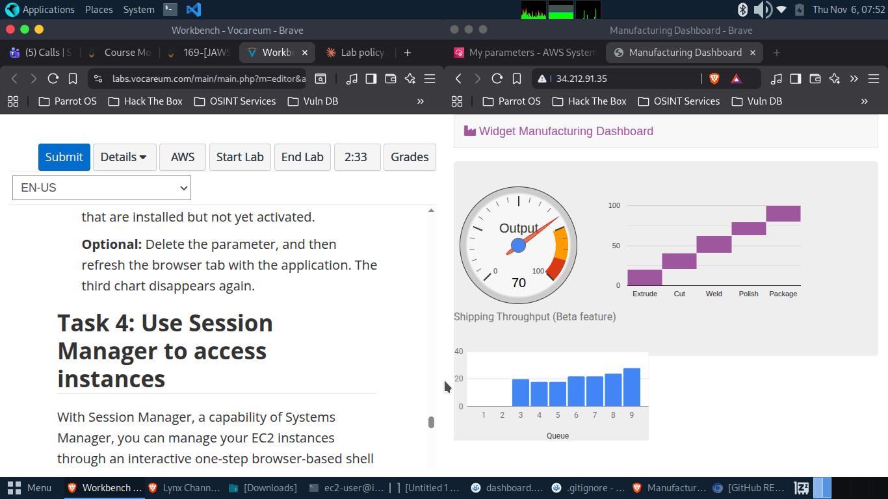

# AWS Systems Manager Hands-On Lab 🚀

A practical demonstration of AWS Systems Manager capabilities for centralized operations and automation across EC2 instances.

## 🎯 Overview

This lab showcases real-world usage of AWS Systems Manager to manage EC2 instances without SSH access. Through four hands-on tasks, you'll experience modern cloud operations management including inventory collection, remote command execution, configuration management, and secure shell access.

## ✨ What I Learned

- **Fleet Management** - Automated inventory collection from managed instances
- **Run Command** - Remote application deployment without SSH
- **Parameter Store** - Centralized configuration management for applications
- **Session Manager** - Secure browser-based shell access

## 🛠️ Technologies Used

- AWS Systems Manager
- Amazon EC2
- AWS Parameter Store
- Session Manager
- Run Command & Fleet Manager

## 📋 Lab Tasks

### Task 1: Fleet Manager & Inventory
Set up automated inventory collection to track software, configurations, and metadata across managed instances. This eliminates the need to manually SSH into each server for audits.

**Key Actions:**
- Created inventory association for EC2 instance
- Configured automated collection of OS and application data
- Reviewed installed applications via Systems Manager console

### Task 2: Run Command
Deployed a complete web application (Widget Manufacturing Dashboard) remotely using Run Command - demonstrating infrastructure automation at scale.

**What Was Installed:**
- Apache web server
- PHP runtime
- AWS SDK
- Custom dashboard application

**No SSH Required** ✅

### Task 3: Parameter Store
Implemented feature flag management using Parameter Store to control application behavior without code changes or redeployment.

**Configuration:**
```
Parameter: /dashboard/show-beta-features
Value: True
Result: Beta charts dynamically displayed in dashboard
```



### Task 4: Session Manager
Accessed EC2 instance command line through browser-based session without opening SSH ports or managing key pairs.

**Commands Executed:**
```bash
# Listed application files
ls /var/www/html

# Retrieved instance metadata and details
aws ec2 describe-instances
```

## 🔒 Security Highlights

- **No SSH keys to manage** - Session Manager provides secure access
- **No inbound ports open** - Eliminated attack surface
- **Fully auditable** - CloudTrail logs all session activity
- **IAM-controlled access** - Fine-grained permissions

## 💡 Key Takeaways

1. **Centralized Management** - Single console for all instance operations
2. **Automation Ready** - All tasks can be scripted via AWS CLI
3. **Zero SSH Dependencies** - Modern alternative to traditional remote access
4. **Configuration as Code** - Parameter Store enables dynamic app configuration
5. **Scale-First Design** - Tag-based targeting enables fleet-wide operations

## 🎓 Skills Demonstrated

- Cloud infrastructure automation
- Secure remote administration
- Configuration management
- Application deployment pipelines
- AWS security best practices

## 📊 Architecture

```
┌─────────────────────────────────────────┐
│           AWS Systems Manager            │
│  ┌────────────────────────────────────┐ │
│  │  Fleet Manager | Run Command       │ │
│  │  Parameter Store | Session Manager │ │
│  └────────────────────────────────────┘ │
└───────────────┬─────────────────────────┘
                │ (No SSH Required)
                ▼
        ┌───────────────┐
        │   VPC         │
        │  ┌─────────┐  │
        │  │  EC2    │  │
        │  │Instance │  │
        │  └─────────┘  │
        └───────────────┘
```

## ⏱️ Lab Duration

**~30 minutes**

## 🔗 Related AWS Services

- Amazon EC2
- AWS IAM
- AWS CloudTrail
- Amazon VPC

## 📝 Notes

This lab demonstrates production-ready practices for managing cloud infrastructure. The techniques shown scale from single instances to thousands of servers across multiple regions.

---

**Status:** ✅ Completed | **Date:** November 2025