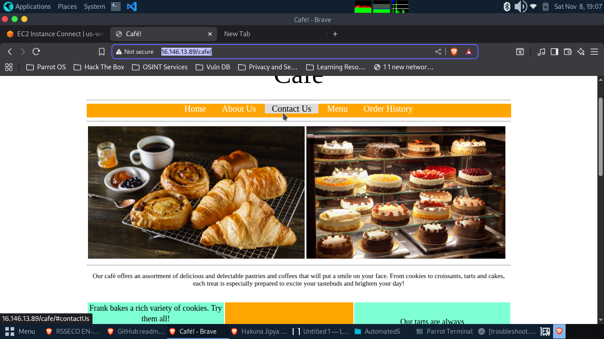

# Troubleshooting EC2 Instance Creation - LAMP Stack Lab

## Overview

This lab demonstrates how to launch and troubleshoot an Amazon EC2 instance using the AWS CLI. The instance is configured as a LAMP stack (Linux, Apache, MySQL/MariaDB, PHP) hosting the Café Web Application with a database backend.



## Architecture

The lab creates a complete web application infrastructure including:
- EC2 instance running Amazon Linux
- Apache web server
- MariaDB database
- PHP runtime
- Café Web Application with order management functionality

## Learning Objectives

- Launch EC2 instances using AWS CLI commands
- Troubleshoot AWS CLI errors and EC2 configuration issues
- Use network diagnostic tools (nmap) for port scanning
- Debug user data scripts and verify cloud-init execution
- Configure security groups for web traffic

## Prerequisites

- AWS account with appropriate permissions
- Basic understanding of Linux command line
- Familiarity with AWS CLI
- Knowledge of networking concepts (ports, security groups)

## Lab Duration

Approximately 45 minutes

## Key Tasks

### Task 1: Connect to CLI Host
- Use EC2 Instance Connect to access the CLI Host instance
- Prepare environment for running AWS CLI commands

### Task 2: Configure AWS CLI
```bash
aws configure
```
Configure with:
- AWS Access Key ID
- AWS Secret Access Key
- Default region
- Output format (json)

### Task 3: Create EC2 Instance with Troubleshooting

#### Scripts Provided
- `create-lamp-instance-v2.sh` - Main deployment script
- `create-lamp-instance-userdata-v2.txt` - User data for instance configuration

#### Common Issues Encountered

**Issue #1: Invalid AMI ID**
- **Error**: `InvalidAMIID.NotFound - The image id '[ami-xxxxxxxxxx]' does not exist`
- **Root Cause**: Incorrect region specified for AMI lookup
- **Resolution**: Verify and correct the region parameter in the `run-instances` command

**Issue #2: Web Server Inaccessible**
- **Symptoms**: Instance created successfully but webpage won't load
- **Troubleshooting Steps**:
  - Verify security group has port 80 (HTTP) open
  - Check if httpd service is running: `sudo systemctl status httpd`
  - Use nmap to scan accessible ports: `nmap -Pn <public-ip>`
- **Resolution**: Update security group rules or start the web server service

### Task 4: Verify Website Functionality

Test the deployed application:
1. **Home Page**: `http://<public-ip>/cafe`
2. **Menu Page**: `http://<public-ip>/cafe/menu.php`
3. **Order Placement**: Test ordering desserts
4. **Order History**: Verify database functionality

## Technical Details

### Script Components

The deployment script performs:
1. Region and VPC discovery
2. Subnet, key pair, and AMI lookup
3. Existing resource cleanup
4. Security group creation (ports 22, 80)
5. EC2 instance launch with user data
6. Public IP assignment monitoring

### User Data Script Functions

- Installs Apache (httpd)
- Installs MariaDB database server
- Installs PHP runtime
- Downloads and extracts Café Web Application files
- Runs database initialization scripts

### Log Monitoring

View user data execution logs:
```bash
sudo tail -f /var/log/cloud-init-output.log
```

View complete log:
```bash
sudo cat /var/log/cloud-init-output.log
```

## Troubleshooting Tools Used

- **AWS CLI**: Instance management and debugging
- **nmap**: Network port scanning
- **cloud-init logs**: User data script verification
- **systemctl**: Service status checking

## Best Practices Demonstrated

- Backing up scripts before modification: `cp script.sh script.backup`
- Using line continuation (`\`) for readable CLI commands
- Implementing cleanup logic for idempotent scripts
- Comprehensive error handling and logging
- Port scanning for security verification

## Security Considerations

- Security group configured with minimal required ports (22, 80)
- SSH access limited to necessary connections
- Database runs locally without external exposure
- User data scripts run with appropriate privileges

## Files in Repository

```
├── create-lamp-instance-v2.sh          # Main deployment script
├── create-lamp-instance-userdata-v2.txt # Instance configuration script
├── create-lamp-instance.backup          # Backup of original script
└── README.md                            # This file
```

## Success Criteria

✅ EC2 instance successfully launched via AWS CLI  
✅ Apache web server responding on port 80  
✅ Café website homepage loads correctly  
✅ Menu page displays available items  
✅ Order placement functionality works  
✅ Order history shows database persistence  

## Troubleshooting Guide - Solutions to Common Issues

### Issue #1: Invalid AMI ID Error

**Error Message:**
```
An error occurred (InvalidAMIID.NotFound) when calling the RunInstances operation: 
The image id '[ami-xxxxxxxxxx]' does not exist
```

**Root Cause:**  
The script retrieves the AMI ID in the discovered region (stored in `$region` variable) but attempts to launch the instance in a hardcoded region (`us-east-1`). Since AMI IDs are region-specific, this causes a mismatch.

**Location in Script:**  
- **Line ~46-50:** AMI ID retrieved using `--region $region`
- **Line ~158:** Instance launch using `--region us-east-1` (hardcoded)

**The Fix:**

Find the `aws ec2 run-instances` command (around line 158):

**BEFORE (Incorrect):**
```bash
instanceDetails=$(aws ec2 run-instances \
--image-id $imageId \
--count 1 \
--instance-type $instanceType \
--region us-east-1 \              # ❌ HARDCODED REGION
--subnet-id $subnetId \
```

**AFTER (Correct):**
```bash
instanceDetails=$(aws ec2 run-instances \
--image-id $imageId \
--count 1 \
--instance-type $instanceType \
--region $region \                # ✅ USES DYNAMIC REGION
--subnet-id $subnetId \
```

**Steps to Fix:**
```bash
vi create-lamp-instance-v2.sh
# Press :158 to go to line 158
# Press 'i' for insert mode
# Change us-east-1 to $region
# Press ESC, then type :wq to save and quit
```

---

### Issue #2: Web Server Not Accessible

**Symptoms:**
- Instance launches successfully
- Public IP assigned
- Cannot access `http://<public-ip>` in browser
- Connection times out or refuses

**Diagnosis Using nmap:**
```bash
nmap -Pn <public-ip>
```

**Incorrect Output:**
```
PORT     STATE  SERVICE
22/tcp   open   ssh
8080/tcp closed http-proxy    # ❌ Wrong port!
```

**Expected Output:**
```
PORT   STATE SERVICE
22/tcp open  ssh
80/tcp open  http              # ✅ Correct!
```

**Root Cause:**  
The security group authorization rule opens port **8080** instead of port **80** (HTTP standard port).

**Location in Script:**  
Around lines 140-150 in the security group creation section.

**The Fix:**

Find the `authorize-security-group-ingress` command for port 80:

**BEFORE (Incorrect):**
```bash
echo "Opening port 80 in the new security group"
aws ec2 authorize-security-group-ingress \
--group-id $sgId \
--protocol tcp \
--port 8080 \                     # ❌ WRONG PORT
--cidr 0.0.0.0/0 \
--profile $profile \
--region $region
```

**AFTER (Correct):**
```bash
echo "Opening port 80 in the new security group"
aws ec2 authorize-security-group-ingress \
--group-id $sgId \
--protocol tcp \
--port 80 \                       # ✅ CORRECT PORT
--cidr 0.0.0.0/0 \
--profile $profile \
--region $region
```

**Steps to Fix:**
```bash
vi create-lamp-instance-v2.sh
# Type /8080 and press Enter to search
# Press 'i' for insert mode
# Change 8080 to 80
# Press ESC, then type :wq to save and quit
```

**After Making Both Fixes:**
```bash
# Run the script
./create-lamp-instance-v2.sh

# When prompted, type Y to delete existing resources
# Wait for completion and note the new public IP

# Verify port 80 is open
nmap -Pn <new-public-ip>

# Test in browser
http://<new-public-ip>
http://<new-public-ip>/cafe
```

---


## Additional Troubleshooting Tips

### If Web Server Still Not Responding

**Connect to the LAMP instance and check:**

```bash
# Check httpd service status
sudo systemctl status httpd

# If not running, start it
sudo systemctl start httpd
sudo systemctl enable httpd

# Check user data execution logs
sudo tail -f /var/log/cloud-init-output.log

# View complete log for errors
sudo cat /var/log/cloud-init-output.log | grep -i error
```

### Verify Security Group Rules via CLI

```bash
# List security groups
aws ec2 describe-security-groups \
  --filters "Name=group-name,Values=*cafeSG*" \
  --query 'SecurityGroups[*].[GroupId,GroupName]'

# Check ingress rules
aws ec2 describe-security-groups \
  --group-ids <sg-id> \
  --query 'SecurityGroups[*].IpPermissions'
```

### Clean Up Resources Between Attempts

```bash
# List running instances
aws ec2 describe-instances \
  --filters "Name=tag:Name,Values=cafeserver" \
  --query 'Reservations[*].Instances[*].[InstanceId,State.Name]'

# Terminate instance
aws ec2 terminate-instances --instance-ids <instance-id>

# Delete security group (after instance is terminated)
aws ec2 delete-security-group --group-id <sg-id>
```

---

## Common Commands Reference

```bash
# Configure AWS CLI
aws configure

# Check instance status
aws ec2 describe-instances --instance-ids <instance-id>

# Scan open ports
nmap -Pn <public-ip>

# Check web server status
sudo systemctl status httpd

# Start web server
sudo systemctl start httpd

# Monitor user data execution
sudo tail -f /var/log/cloud-init-output.log
```

## Lessons Learned

1. **Region Consistency:** Always verify region consistency when working with AMIs - AMI IDs are region-specific
2. **Port Configuration:** Security groups must explicitly allow required ports - verify with nmap
3. **Script Variables:** Use variables instead of hardcoded values for flexibility and correctness
4. **Log Monitoring:** User data scripts can be monitored via cloud-init logs for debugging
5. **Network Diagnostics:** Tools like nmap are essential for troubleshooting connectivity issues
6. **Idempotent Scripts:** Include cleanup logic to make scripts repeatable for testing

## Contributing

This is a training lab exercise. If you've found additional troubleshooting scenarios or improvements, feel free to document them.

